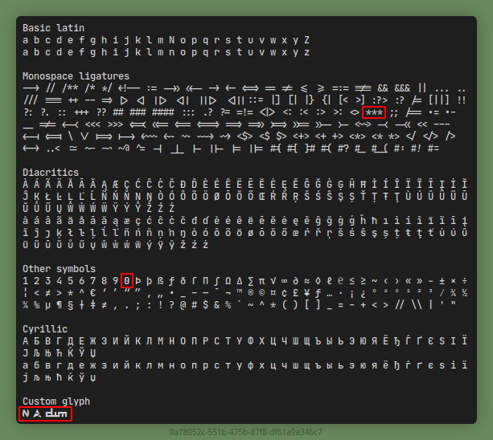

# JetBrainsMono Nerd Font Bandit - Medium

This is a JetBrainsMono Nerd Font Medium with some modification on:

1. Align ligature for triple asterisks `***` to same level between each of them
2. Zero `0` not using "dotted zero", but using "back slashed zero"
3. Add Neovim logo on `U+E630`
4. Add Artix logo on `U+E631`
5. Add DWM logo on `U+E62F`



## Install

Just copy the **JetBrainsMonoNerdFontCompleteBandit-Medium.ttf* your **/usr/share/fonts/**, then update font cache with,

```shell
$ sudo fc-cache -vf
```

## Usage

**Family Font Name**

```
JetBrainsMono Nerd Font Bandit
```

**Available Style**

```
Medium, Regular
```

**Example on Simple Terminal**

```
JetBrainsMono Nerd Font Bandit:style=Medium,Regular:pixelsize=10
```

## Original Project

[**JetBrains/JetBrainsMono**](https://github.com/JetBrains/JetBrainsMono)

## License

JetBrains Mono typeface is available under the [OFL-1.1](OFL.txt) License and can be used free of charge, for both commercial and non-commercial purposes. You do not need to give credit to JetBrains, although we will appreciate it very much if you do.

The source code is available under [Apache 2.0](https://www.apache.org/licenses/LICENSE-2.0) License
